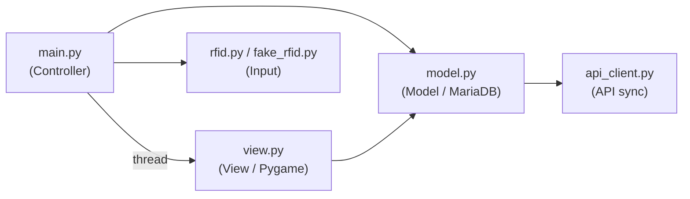
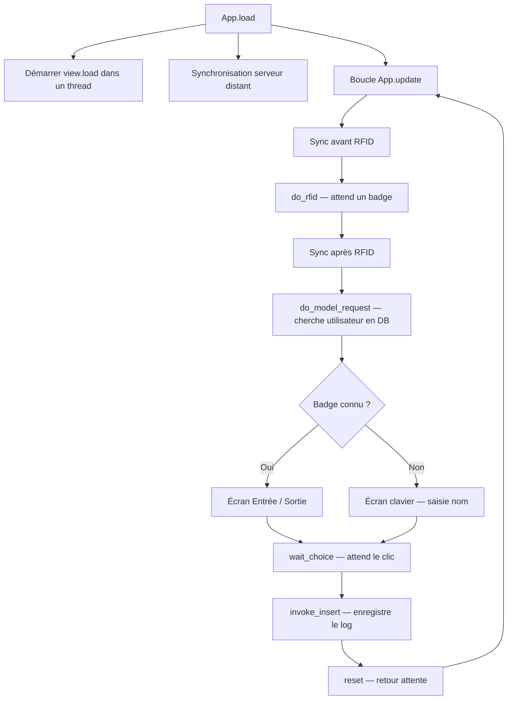
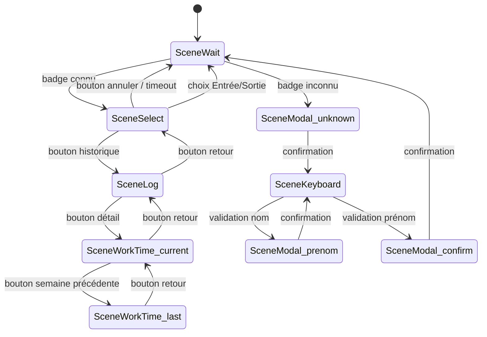
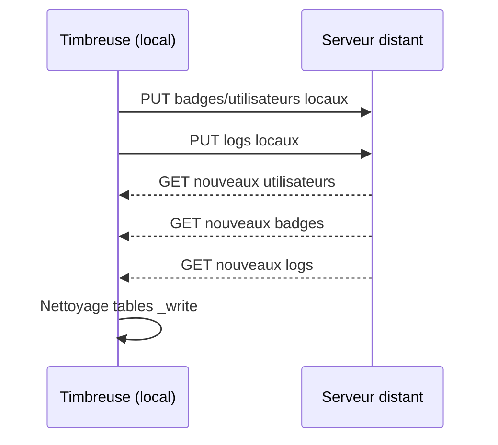

# Architecture technique — Timbreuse

## Vue d'ensemble

L'application suit un pattern **MVC multi-threadé** :



## Flux principal



## Communication inter-threads

`main.py` et `view.py` communiquent via un dictionnaire partagé `pipe` :

```python
pipe = {
    "id_badge": int,        # ID du badge scanné
    "name": str,            # Nom de l'utilisateur
    "surname": str,         # Prénom
    "inside": bool | None,  # True=entrée, False=sortie, None=pas encore choisi
    "log": list[dict],      # 5 derniers pointages
    "cancel": bool,         # Annulation (timeout ou bouton)
    "quit": bool,           # Fermeture de l'app
    "new_user_valid": bool, # Nouveau badge validé
    "th_condition": Condition, # Synchronisation des threads
    # + time_current_week, time_last_week, day_current_week, day_last_week
}
```

La synchronisation utilise `threading.Condition` : `main.py` attend avec `wait()`, `view.py` notifie avec `notify_all()` quand l'utilisateur fait un choix.

## Scènes de l'interface (view.py)



Toutes les scènes avec timer (`SceneTime`) reviennent automatiquement à `SceneWait` après 1 minute d'inactivité.

## Base de données

### Tables principales

| Table | Rôle |
|-------|------|
| `user_sync` | Utilisateurs synchronisés depuis le serveur |
| `user_write` | Utilisateurs créés localement (badge inconnu) |
| `badge_sync` | Badges synchronisés depuis le serveur |
| `badge_write` | Badges créés localement |
| `log_sync` | Pointages synchronisés depuis le serveur |
| `log_write` | Pointages créés localement |

### Vues

| Vue | Rôle |
|-----|------|
| `user` | Union de `user_sync` et `user_write` (sans doublons) |
| `badge` | Union de `badge_sync` et `badge_write` (sans doublons) |
| `log` | Union de `log_sync` et `log_write` (sans doublons, triés par date) |

### Principe sync/write

Les tables `_write` stockent les données créées localement. Les tables `_sync` contiennent les données provenant du serveur distant. Les vues fusionnent les deux en éliminant les doublons. Après synchronisation, les procédures `delete_*_write` nettoient les entrées locales déjà synchronisées.

### Procédures stockées

| Procédure | Rôle |
|-----------|------|
| `insert_log` | Insère un pointage local + nettoyage |
| `insert_sync_log` | Insère un pointage depuis le serveur |
| `insert_user` / `insert_user_sync` | Insère un utilisateur local / depuis serveur |
| `insert_badge` / `insert_badge_sync` | Insère un badge local / depuis serveur |
| `delete_log_write` / `delete_badge_write` / `delete_user_write` | Nettoyage des tables locales après sync |
| `delete_badge_and_user_write` | Nettoyage combiné badges + utilisateurs |

## Synchronisation avec le serveur distant

`api_client.py` communique avec `https://timbreuse.sectioninformatique.ch` via des requêtes HTTP GET/PUT authentifiées par HMAC-SHA256 (clé dans `.key.json`).



## Développement sur Windows

Sur Windows (`os.name == 'nt'`) :
- `fake_rfid.py` est chargé automatiquement à la place de `rfid.py` (badge simulé ID 63)
- La fenêtre Pygame s'ouvre en mode fenêtré (800x480) au lieu du plein écran
- Le curseur de la souris reste visible
- MariaDB tourne dans un container Docker
