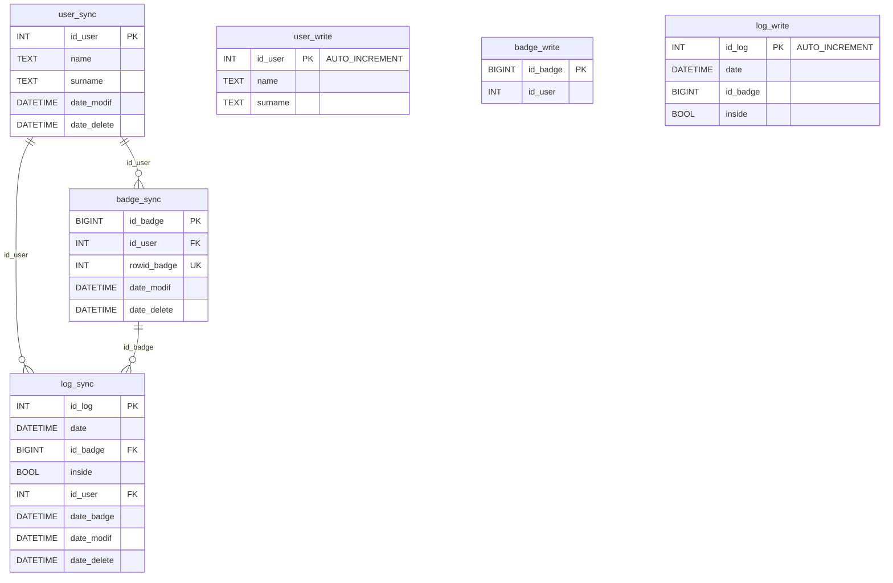
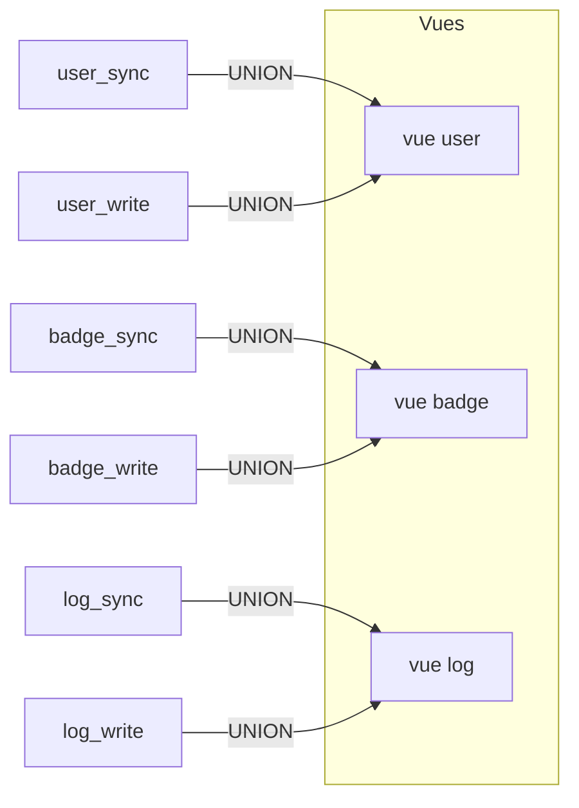
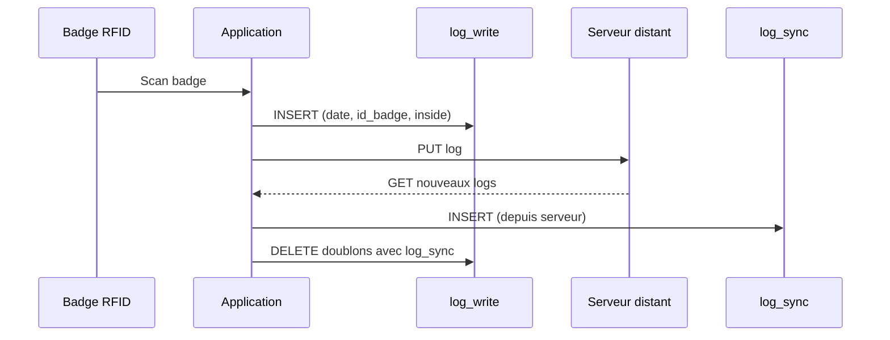

# Schéma de base de données — Timbreuse

## Diagramme relationnel



## Vues (fusion sync + write)



Les vues éliminent les doublons : si une entrée existe dans `_sync`, l'entrée correspondante dans `_write` est ignorée.

## Cycle de vie des données



## Initialisation

```bash
# Créer la base et les tables
docker exec timbreuse-db bash -c "mariadb -u root < /tmp/createDB.sql"

# Créer les procédures stockées
docker exec timbreuse-db bash -c "mariadb -u root < /tmp/procedures.sql"

# Charger les données de test
docker exec timbreuse-db bash -c "mariadb -u root < /tmp/test_data.sql"
```

## Données de test

Le fichier `sql/test_data.sql` contient :
- 3 utilisateurs (Dupont Jean, Martin Sophie, Müller Hans)
- 3 badges (dont le badge 63 utilisé par `fake_rfid.py`)
- Des logs sur 2 semaines pour tester l'affichage des heures
