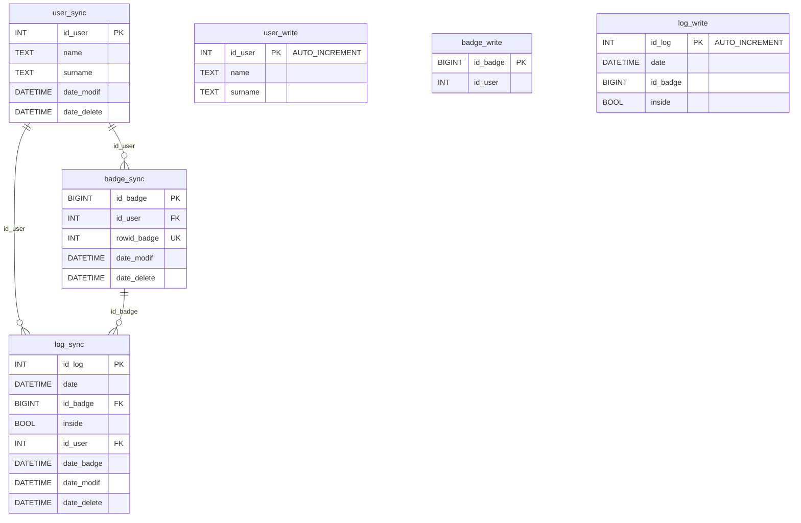
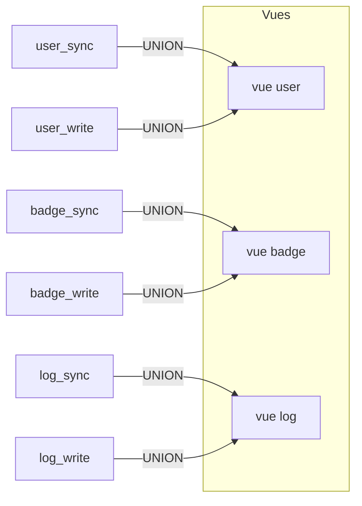
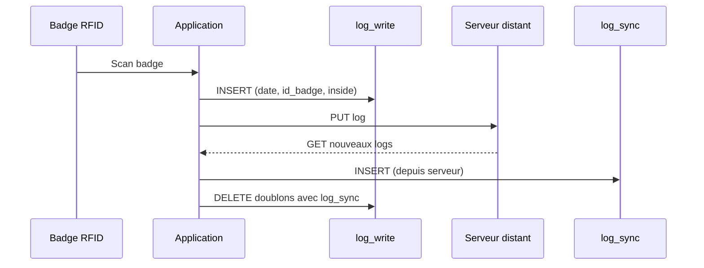

# Schéma de base de données — Timbreuse

## Diagramme relationnel



## Vues (fusion sync + write)



Les vues éliminent les doublons : si une entrée existe dans `_sync`, l'entrée correspondante dans `_write` est ignorée.

## Cycle de vie des données



## Initialisation

```bash
# Créer la base et les tables
docker exec timbreuse-db bash -c "mariadb -u root < /tmp/createDB.sql"

# Créer les procédures stockées
docker exec timbreuse-db bash -c "mariadb -u root < /tmp/procedures.sql"

# Charger les données de test
docker exec timbreuse-db bash -c "mariadb -u root < /tmp/test_data.sql"
```

## Données de test

Le fichier `sql/test_data.sql` contient :
- 3 utilisateurs (Dupont Jean, Martin Sophie, Müller Hans)
- 3 badges (dont le badge 63 utilisé par `fake_rfid.py`)
- Des logs sur 2 semaines pour tester l'affichage des heures

## Complément E2E (tests bout en bout)

Le scénario décrit dans `tests/E2E/README.md` valide un flux client + serveur sur les suppressions distantes (soft/hard delete).

### Tables impliquées dans la validation E2E

- **Côté serveur (`timbreuse-srv`)**
  - `event_type` : journal d'événements métier, incluant les événements `hard_delete`.
  - `user_sync`, `badge_sync`, `log_sync` : source de vérité distante (avec soft delete via `date_delete`).
- **Côté client (`Timbreuse`)**
  - `event_log_sync` : réception des événements serveur, avec un flag `processed` pour confirmer l'application locale.
  - `user_sync`, `badge_sync`, `log_sync` : miroir local synchronisé depuis le serveur.
  - `*_write` : données locales en attente de synchronisation.

### Règles de suppression vérifiées

- **Soft delete** : la ligne reste présente, `date_delete` est renseigné.
- **Hard delete** : la ligne est physiquement supprimée côté serveur et un événement `hard_delete` doit être émis.
- **Attendu côté client** : l'événement est importé dans `event_log_sync`, appliqué idempotemment, puis marqué `processed=1`.

### Validation SQL minimale recommandée (E2E)

Les snapshots SQL du scénario E2E sont consignés dans `tests/E2E/logs/E2E_logs.txt`.
Vérifier au minimum :

- suppression effective du badge ciblé (hard delete),
- état d'attribution du badge réaffecté,
- présence/état de soft delete de l'utilisateur concerné,
- présence d'un événement `hard_delete` côté serveur (`event_type`),
- réception et traitement côté client (`event_log_sync.processed=1`).
